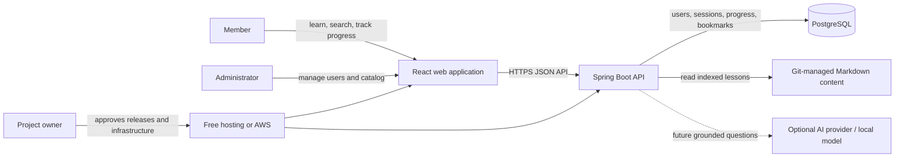
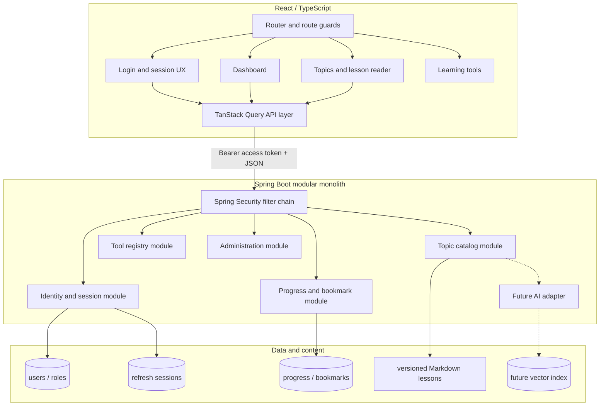
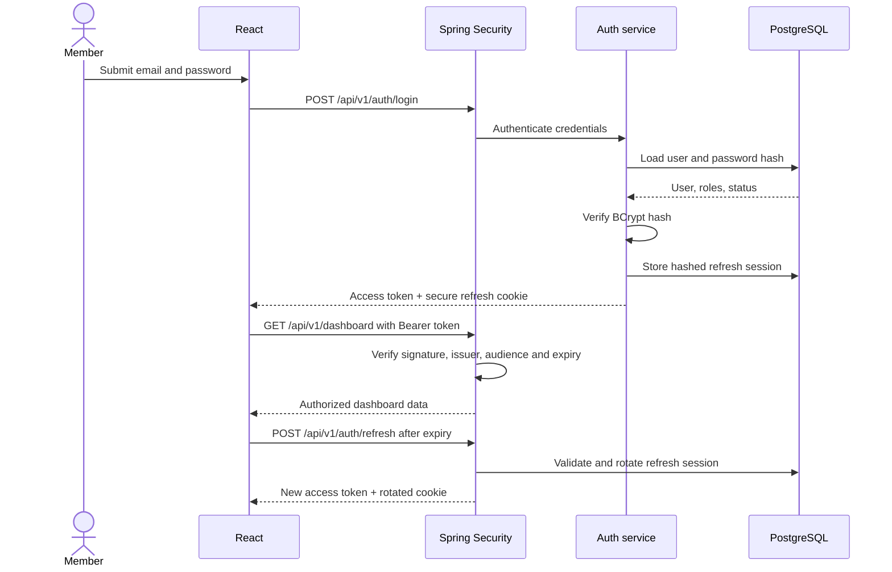
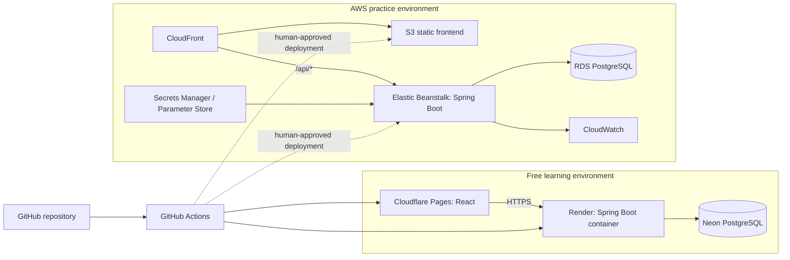

# System architecture

## Context

The Start Is Here is a modular monolith with a React single-page application, a Spring Boot API, PostgreSQL persistence, and repository-managed learning content. It begins as a learning project and retains clear boundaries so features can grow without prematurely introducing microservices.

## System context

## Application containers

## Authentication flow

## Static and dynamic boundaries

| Capability | Static or versioned | Dynamic or persisted |
|---|---|---|
| Application shell and design system | Yes | No |
| Lesson Markdown and topic metadata | Yes initially | Admin editing may come later |
| Tool definitions | Yes initially | Usage history later |
| Users, password hashes and roles | No | Yes |
| Refresh sessions and revocation | No | Yes |
| Progress, bookmarks and recent activity | No | Yes |
| Search | Build-time index initially | Personalized search later |
| AI conversations and feedback | No | Future dynamic feature |

## Deployment topology

## Security boundaries

- Access tokens are short-lived and retained in browser memory.
- Refresh tokens use `HttpOnly`, `Secure`, and appropriate `SameSite` cookies.
- Only hashes of refresh tokens are persisted.
- Passwords use an adaptive password hash such as BCrypt.
- The API validates JWT signature, issuer, audience, expiry, and authorization claims.
- CORS is restricted to configured frontend origins.
- Secrets enter deployments through environment or managed secret stores, never Git.
- Authentication, authorization, token rotation, replay, and logout receive integration tests.

## Evolution path

1. Authentication and protected dashboard.
2. Versioned learning catalog, progress, and bookmarks.
3. Administration and improved search.
4. Local-model experimentation with Ollama.
5. Grounded lesson assistant through a provider-neutral AI interface.
6. Vector search and evaluation only after content and privacy policies are established.
