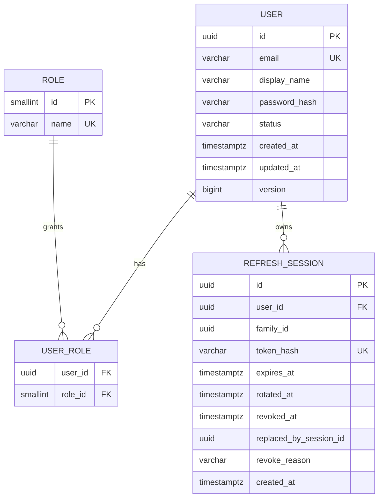
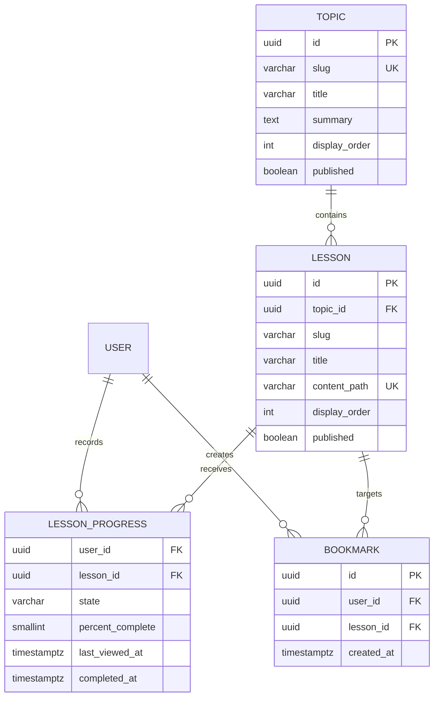

# Data model contract

## Milestone 1 entities

## Constraints

- Normalize email for comparison and enforce uniqueness at the database boundary.
- User status is one of `INVITED`, `ACTIVE`, `LOCKED`, or `DISABLED`.
- Role name is one of `MEMBER` or `ADMIN` for v0.
- `USER_ROLE` has a composite primary key.
- Refresh expiry must be later than creation.
- A rotated session points to its replacement and cannot be used again.
- Application timestamps use UTC instants; presentation uses the member's locale later.
- Optimistic versioning protects user updates.

## Milestone 2 entities

Lesson bodies remain Markdown files. Database records provide stable identifiers, ordering, publication state, and relationships to personal data.

## Migration policy

- Flyway migrations are append-only after merging.
- Schema changes and seed changes are separate migrations.
- Development seed users never contain production credentials.
- Integration tests start from an empty PostgreSQL database and apply the complete migration chain.
